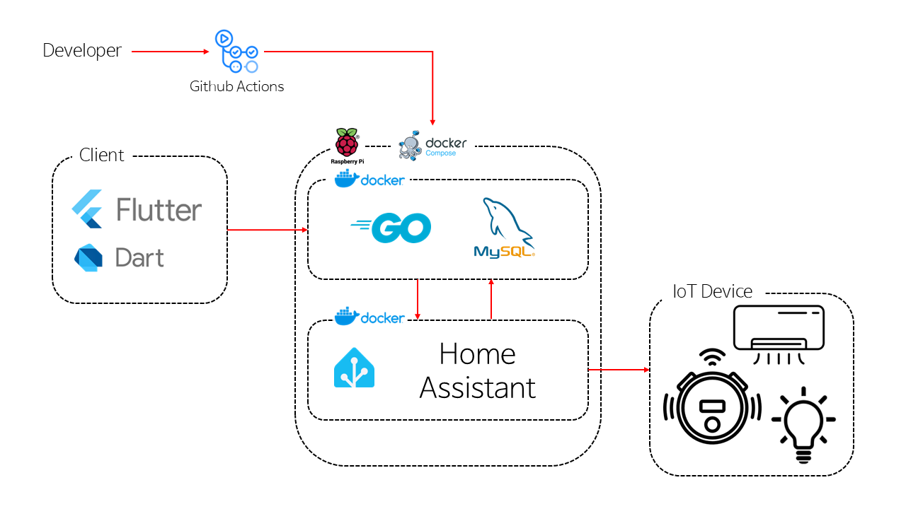

# IoT Smart Home Client

Flutter로 개발된 스마트홈 IoT 클라이언트 애플리케이션입니다. 이 앱은 다양한 스마트 기기들을 모니터링하고 제어할 수 있는 직관적인 인터페이스를 제공합니다.


## 프로젝트 시스템 아키텍처


## 주요 기능

### 1. 스마트 기기 제어
- 로봇청소기, 스마트 조명, 에어컨, TV 등 다양한 스마트 기기 지원
- 직관적인 UI로 기기 상태 모니터링 및 제어
- 다크 모드/라이트 모드 지원

### 2. 로봇청소기 특화 기능
- 실시간 상태 모니터링 (청소 중, 도킹 중, 귀환 중 등)
- 원격 제어 기능 (청소 시작, 일시정지, 귀환)
- 배터리 잔량 및 팬 속도 모니터링
- 1초마다 자동 상태 업데이트

### 3. 기기 관리
- 기기 목록 보기
- 기기 추가/제거
- 기기 상태 실시간 업데이트

### 4. 스케줄링
- 기기별 자동화 스케줄 설정
- 요일별, 시간별 예약 기능

## 기술 스택

- **프레임워크**: Flutter
- **언어**: Dart
- **상태 관리**: Flutter State Management
- **UI 컴포넌트**: Material Design, Cupertino
- **HTTP 통신**: http package
- **폰트**: Google Fonts

## 프로젝트 구조

```
lib/
├── icons/          # 기기 아이콘 이미지
│   ├── robot-vaccum.png
│   ├── light-bulb.png
│   ├── air-conditioner.png
│   └── TV.png
├── models/         # 데이터 모델
│   ├── device.dart              # 스마트 기기 기본 모델
│   └── vacuum_status.dart       # 로봇청소기 상태 및 속성 모델
├── pages/         # 화면
│   ├── home_page.dart           # 홈 화면 (기기 그리드 뷰)
│   ├── devices_list_page.dart   # 기기 목록 화면
│   ├── robot_vacuum_status_page.dart  # 로봇청소기 상세 제어 화면
│   ├── schedule_page.dart       # 기기 스케줄 관리 화면
│   └── settings_page.dart       # 앱 설정 화면
├── services/      # API 서비스
│   └── vacuum_service.dart      # 로봇청소기 API 통신 서비스
├── util/         # 유틸리티
│   └── smart_device_box.dart    # 기기 컨트롤 박스 위젯
└── main.dart     # 앱 진입점 및 테마 설정

```

### 주요 컴포넌트 설명

#### Models
- `Device`: 스마트 기기의 기본 정보와 상태를 관리하는 모델
- `VacuumStatus`: 로봇청소기의 상세 상태와 속성을 관리하는 모델

#### Pages
- `HomePage`: 메인 화면으로, 기기들을 그리드 형태로 표시
- `DevicesListPage`: 모든 기기의 목록을 표시하고 관리
- `RobotVacuumStatusPage`: 로봇청소기의 상세 제어 및 상태 모니터링
- `SchedulePage`: 기기별 자동화 스케줄 관리
- `SettingsPage`: 앱 설정 (다크 모드, 언어 등)

#### Services
- `VacuumService`: 로봇청소기와의 HTTP 통신을 담당하는 서비스
  - 서버 상태 확인
  - 청소기 상태 조회
  - 청소 시작/일시정지/귀환 명령

#### Utils
- `SmartDeviceBox`: 재사용 가능한 기기 컨트롤 위젯
  - 기기 상태 표시
  - 전원 제어
  - 로봇청소기 특화 기능

## 시작하기

### 필수 조건
- Flutter SDK (최신 버전)
- Dart SDK (최신 버전)
- Android Studio / VS Code
- Android/iOS 시뮬레이터 또는 실제 기기

### 설치 및 실행
1. 저장소 클론
```bash
git clone https://github.com/Chocobone/iot_client.git
cd iot_client
```

2. 의존성 설치
```bash
flutter pub get
```

3. 앱 실행
```bash
flutter run
```

## 서버 설정

앱은 기본적으로 `http://192.168.35.145:18000`에서 실행되는 IoT 서버와 통신합니다. 
서버 주소를 변경하려면 `lib/services/vacuum_service.dart`의 `baseUrl`을 수정하세요.

## 기여하기

1. Fork the Project
2. Create your Feature Branch (`git checkout -b feature/AmazingFeature`)
3. Commit your Changes (`git commit -m 'Add some AmazingFeature'`)
4. Push to the Branch (`git push origin feature/AmazingFeature`)
5. Open a Pull Request

## 라이선스

이 프로젝트는 MIT 라이선스 하에 배포됩니다. 자세한 내용은 `LICENSE` 파일을 참조하세요.
